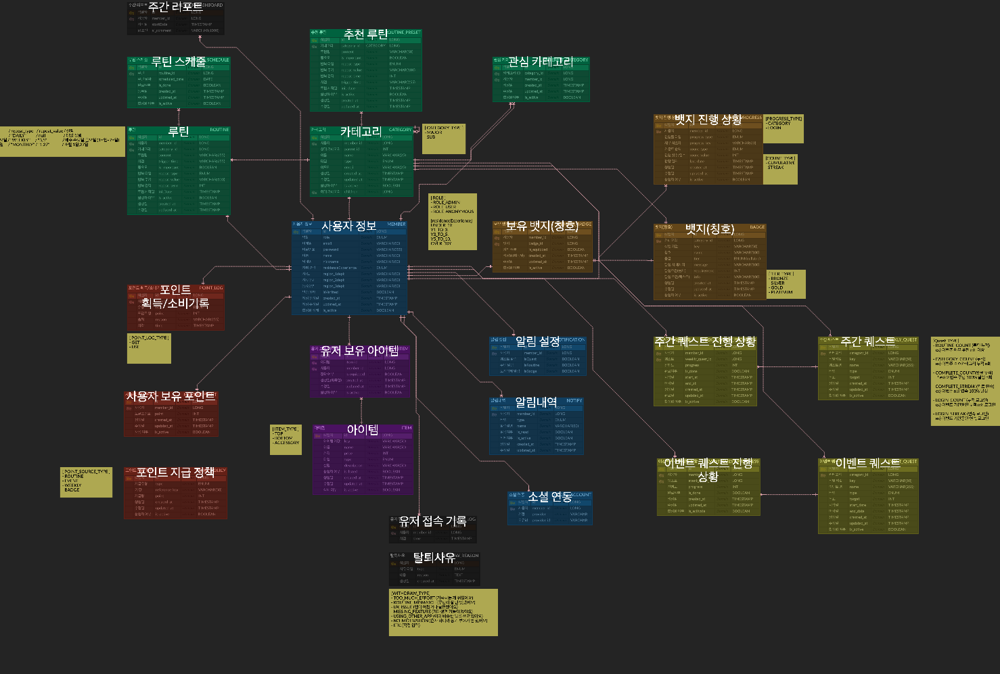

    

# 루티(Routie)

> 게임적 요소가 결합된 루틴 관리 플랫폼 **"루티\(Routie)"** 의 백엔드 레포지토리 입니다.
>
> \- 데브코드 웹 백엔드 5기 6회차 1팀 깃허브충돌위원회\(WCC) -

### 🧑🏻‍💻 팀원 소개 :: 깃허브충돌위원회 - 백엔드 팀

<table>
  <tbody>
<tr>
      <td align="center"><b>최대열</b> PO</td>
      <td align="center"><b>정성원</b> 팀장</td>
      <td align="center"><b>강민서</b> 팀원</td>
      <td align="center"><b>김가희</b> 팀원</td>
      <td align="center"><b>오준혁</b> 팀원</td>
     <tr/>

<tr>
          <td align="center"></td>
          <td align="center"></td>
          <td align="center"></td>
          <td align="center"></td>
          <td align="center"></td>
     <tr/>

<tr>    
      <td align="center"><a href="https://github.com/DY-Tempus"><b>@DY-Tempus</b></a> </td>
      <td align="center"><a href="https://github.com/oharang"><b>@oharang</b></a> </td>
      <td align="center"><a href="https://github.com/childstone"><b>@childstone</b></a> </td>
      <td align="center"><a href="https://github.com/syongsyong6035"><b>@syongsyong6035</b></a> </td>
      <td align="center"><a href="https://github.com/wnsur1234"><b>@wnsur1234</b></a> </td>
     <tr/>

  </tbody>
</table>

---

### ✅ 서비스 소개

> 서비스 주소 : https://littlestep-routie.vercel.app
>
> ⚠️ 서비스 주소는 추후 삭제되거나 달라질 수 있습니다.

- **"루티\(Routie)"** 는 게임적 요소가 결합된 루틴 관리 플랫폼 입니다.
- 루틴 달성, 퀘스트 완료, 업적 달성 등을 통해 포인트를 얻고, 상점에서 아이템을 구매해 캐릭터를 꾸며나 갈 수 있습니다.
- 업적을 달성했을 때, 칭호를 획득할 수 있으며 자신의 프로필에 적용할 수 있습니다.
- 이러한 게임적 요소를 통해, 루틴 관리에 익숙하지 않거나 규칙적인 생활을 하는데 있어 동기부여가 잘 안되는 사용자를 대상으로 꾸준하고 지속적으로 루틴을 관리하고 실천하는 습관을
  유도하는 서비스입니다.

---

### 🛠️ 주요 기능 소개

- 루틴 등록 및 완료 체크
- 주간 루틴 캘린더
- 주간 리포트
- 주간 / 이벤트 퀘스트
- 업적 도감 / 칭호
- 아이템 상점
- 마이페이지 (캐릭터 치장)
- 실시간 루틴 / 퀘스트 / 업적 알림

---

### ⚙️ 기술 스택

---

### 💾 ERD

